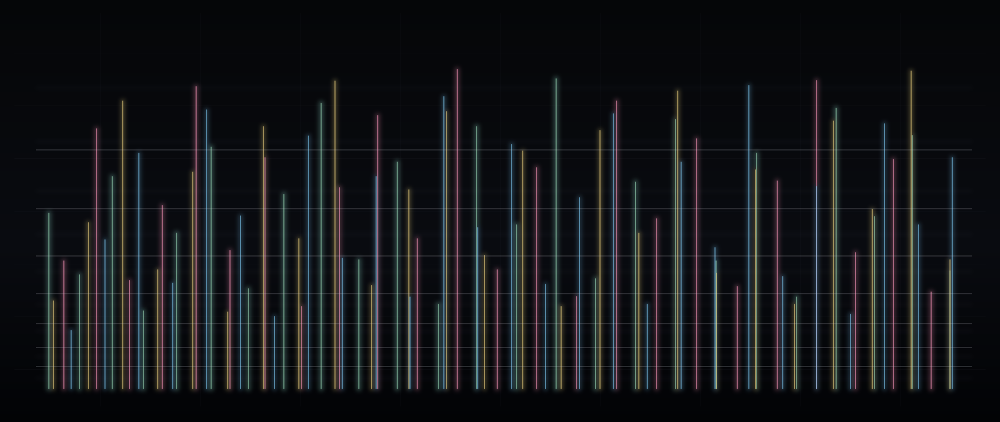

# Ultraviolett

### Overtone Multiplication Study for Four Saxophone Spectra

*Ultraviolett* is an autonomous Max/MSP study of resonance, spectral inheritance, and the mutable density of an imaginary saxophone ensemble.

The title names something present yet withheld. Human vision occupies only a narrow interval of the electromagnetic spectrum; ultraviolet and infrared continue beyond its borders. Arctic reindeer extend their sensitivity into the ultraviolet, and objects that almost disappear within human vision can become decisive marks in another animal's perceptual field. The invisible is not necessarily absent. It may be active, concrete, even orienting.

The work carries this thought from seeing into listening. A saxophone multiphonic often arrives as a fused colour, or as two unstable pitches held in tension. Yet within it lives a more crowded body: quiet partials, beating proximities, veiled resonances, and tones near the threshold of attention. *Ultraviolett* places these marginal presences under magnification. A frequency that is nearly hidden in one sonority may be illuminated by another; what first seemed incidental becomes the thread by which two colours touch.

The source material comes from spectral analyses of the recorded examples accompanying Marcus Weiss and Giorgio Netti's *The Techniques of Saxophone Playing / Die Spieltechnik des Saxophons*. Weiss and Netti are the authors of the handbook and its systematic catalogue of multiphonics. Their recordings are not reproduced or distributed here. The patch retains only reduced analytical traces - frequencies and relative intensities - and uses them as material for an independent act of resynthesis.

The historical horizon is deliberately porous. Alvin Lucier's attention to resonance suggests that sound can disclose conditions already present in a space. John Cage offers permission to regard a system as a field of possible events rather than a vehicle for a predetermined statement. Spectral music, especially the work of Gérard Grisey and Tristan Murail, established the inner life of sound as compositional material. *Ultraviolett*, however, does not translate analysis into a directed developmental form. It remains with comparison, suspension, and slow mutation.

Its temporality is therefore closer to an ambient condition than to a dramatic argument. Brian Eno's idea of music as an environment, together with the attenuated digital fields of Taylor Deupree and Richard Chartier, informs a listening situation in which attention may move between foreground and periphery. One to four spectral bodies gather, coexist, and recede. Their relations are contingent but not arbitrary: a few components form bridges, while the rest preserve difference and occupy another region of the audible field.

The resulting sound is not a simulation of four living saxophonists. Breath, instability, nonlinear coupling, spatial radiation, and mutual acoustic influence remain outside the sine-wave model. The patch is better understood as a laboratory instrument, or a dim optical device translated into sound: a means of observing spectral kinship until faint structures begin to appear.

In Presentation Mode the same process becomes a slowly moving visual memory. Low frequencies remain below, high frequencies rise, and four restrained colours cross and accumulate. The image is not offered as scientific measurement. It is a parallel field of attention - light and shadow passing through the internal architecture of sound.

## Source and attribution

Weiss, Marcus, and Giorgio Netti. *The Techniques of Saxophone Playing / Die Spieltechnik des Saxophons*. Kassel: Bärenreiter, 2010.

Concept, software, spectral analysis, and text: **Dmitrii Shchukin**

© 2026 Dmitrii Shchukin. All rights reserved.

## Use

Open `Ultraviolett.maxpat` in Max 8.5 or later. No external packages are required. Enable audio with the speaker icon, then switch on `RUN`.
